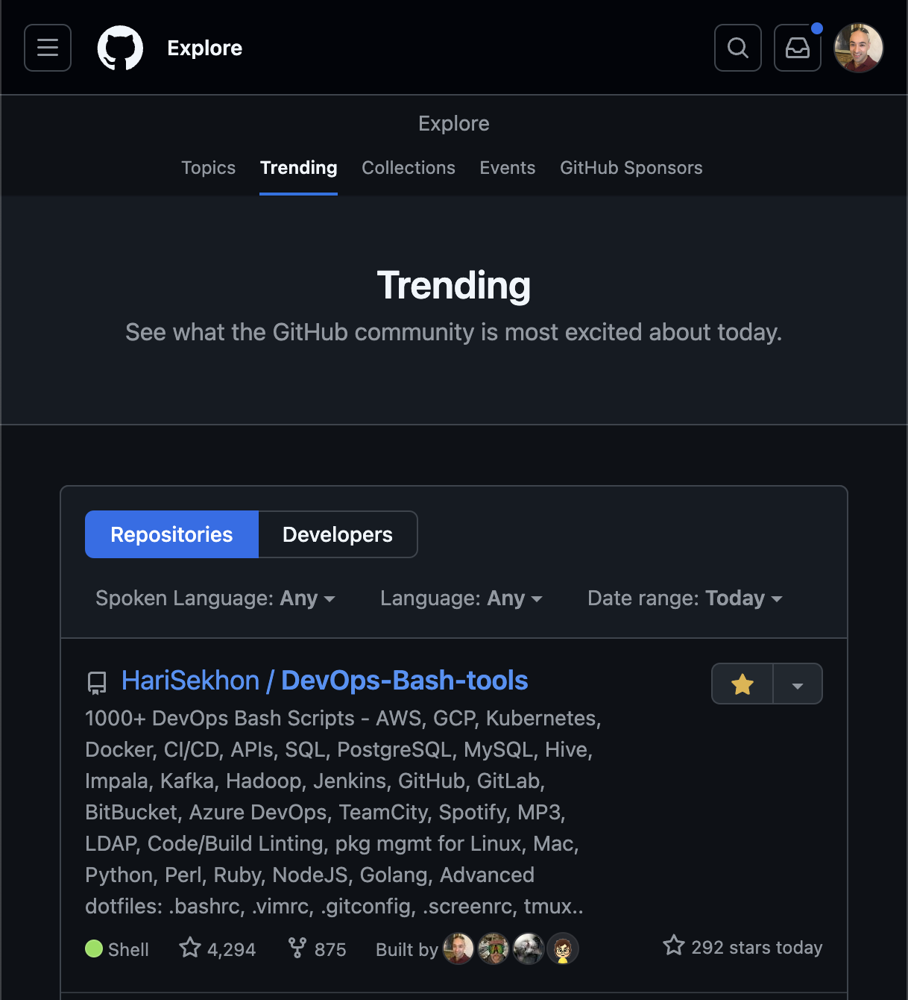
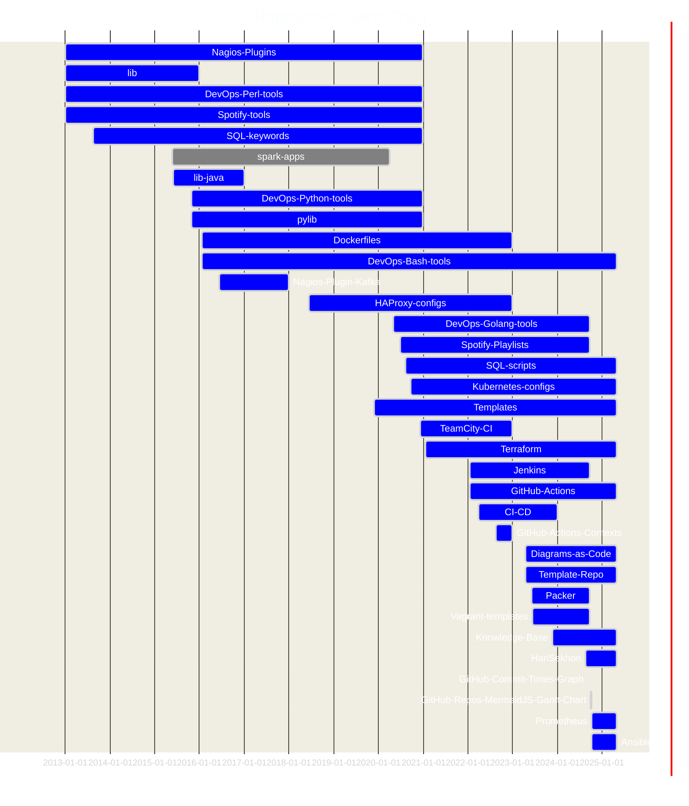

# Hari Sekhon's GitHub

<!--
**HariSekhon/HariSekhon** is a ✨ _special_ ✨ repository because its `README.md` (this file) appears on your GitHub profile.

Here are some ideas to get you started:

- 🔭 I’m currently working on ...
- 🌱 I’m currently learning ...
- 👯 I’m looking to collaborate on ...
- 🤔 I’m looking for help with ...
- 💬 Ask me about ...
- 📫 How to reach me: ...
- 😄 Pronouns: ...
- ⚡ Fun fact: ...

-->

<!--

  View Counters komarev.com/ghpvc and Yhype don't count views from other sites like GitLab, Azure DevOps or
  Bitbucket README or profile pages

      https://github.com/antonkomarev/github-profile-views-counter/issues/96

-->

## About Me

20 Year IT veteran with many domain specialities. GitHub addict.

💬 Ask me about: DevOps, Cloud, Data, Coding, APIs...

✉️ Contact me on [LinkedIn](https://www.linkedin.com/in/HariSekhon/):

🔍 Secondary Expertise in:

- 🧑‍🤝‍🧑 Sociology
- 💰 Economics
- 📉 Demographics
- Private message me on [LinkedIn](https://www.linkedin.com/in/HariSekhon/)
  for the answer to The Root Cause of Western Decline 📉
  - as well as excellent resources on everything from jobs & money, to relationships & divorce, to emigration & taxes

## Public Open Source Stats

This does not include any private repos such as my corporate work eg. where most of my Pull Requests and many of my
commits went.

This only includes my public open source repos:

<!--

-->

<!--

-->

<!--

-->

<!--

-->

[Top Ranked by UK commits](https://github.com/gayanvoice/top-github-users/blob/main/markdown/public_contributions/united_kingdom.md)

## Core Public Repos

GitHub's limit of 6 pinned repos is far too low - these are what I consider my core open source public repos:

<!-- REPOS_START -->

### Knowledge

<!--

Not support on GitHub Markdown:

<iframe src="https://raw.githubusercontent.com/HariSekhon/HariSekhon/main/knowledge.md" width="100%" height="500px"></iframe>

Does nothing:

<embed src="https://raw.githubusercontent.com/HariSekhon/HariSekhon/main/knowledge.md" width="100%" height="500px" />

-->

### DevOps Code

<!--

-->

### Containerization

### CI/CD

### Databases - DBA - SQL

### DevOps Reloaded

### Monitoring

### Templates

### Spotify

The rest of my original source repos are
[here](https://github.com/HariSekhon?tab=repositories&q=&type=source&language=&sort=stargazers).

Pre-built Docker images are available on my [DockerHub](https://hub.docker.com/u/harisekhon/).

## Tech

I've worked on far too many technologies to list, but
here is a shortlist of some of the more still popular ones you might recognize:

<!-- Generated here:

    https://marwin1991.github.io/profile-technology-icons/

-->

  <table>
    <tr>
      <td>
        
      </td>
      <td>
        
      </td>
      <td>
        
      </td>
      <td>
        
      </td>
      <td>
        
      </td>
      <td>
        
      </td>
      <td>
          
      </td>
    </tr>
    <tr>
      <td>
        
      </td>
      <td>
        
      </td>
      <td>
        
      </td>
      <td>
        
      </td>
      <td>
        
      </td>
      <td>
        
      </td>
      <td>
        
      </td>
    </tr>
    <tr>
      <td>
        
      </td>
      <td>
        
      </td>
      <td>
        
      </td>
      <td>
        
      </td>
      <td>
        
      </td>
      <td>
        
      </td>
      <td>
        
      </td>
    </tr>
    <tr>
      <td>
        
      </td>
      <td>
        
      </td>
      <td>
        
      </td>
      <td>
        
      </td>
      <td>
        
      </td>
      <!--
      <td>
        
      </td>
      -->
      <td>
        
      </td>
      <td>
        
      </td>
    </tr>
  </table>

</table>

## Cocomo - Estimates of Man Years & Costs

<!--

Generated using scripts/generate_repos_table.sh

-->

### Repos

<table>
    <tr>
        <td>
            
        </td>
        <td>
            
        </td>
        <td>
            
        </td>
        <td>
            
        </td>
        <td>
            
        </td>
    </tr>
    <tr>
        <td>
            
        </td>
        <td>
            
        </td>
        <td>
            
        </td>
        <td>
            
        </td>
        <td>
            
        </td>
    </tr>
    <tr>
        <td>
            
        </td>
        <td>
            
        </td>
        <td>
            
        </td>
        <td>
            
        </td>
        <td>
            
        </td>
    </tr>
    <tr>
        <td>
            
        </td>
        <td>
            
        </td>
        <td>
            
        </td>
        <td>
            
        </td>
        <td>
            
        </td>
    </tr>
    <tr>
        <td>
            
        </td>
        <td>
            
        </td>
        <td>
            
        </td>
        <td>
            
        </td>
        <td>
            
        </td>
    </tr>
    <tr>
        <td>
            
        </td>
        <td>
            
        </td>
        <td>
            
        </td>
        <td>
            
        </td>
        <td>
            
        </td>
    </tr>
    <tr>
        <td>
            
        </td>
        <td>
            
        </td>
        <td>
            
        </td>
        <td>
            
        </td>
        <td>
            
        </td>
    </tr>
    <tr>
        <td>
            
        </td>
        <td>
            
        </td>
        <td>
            
        </td>
        <td>
            
        </td>
        <td>
            
        </td>
    </tr>
    <tr>
        <td>
            
        </td>
        <td>
            
        </td>
        <td>
            
        </td>
        <td>
            
        </td>
        <td>
            
        </td>
    </tr>
    <tr>
        <td>
            
        </td>
        <td>
            
        </td>
        <td>
            
        </td>
        <td>
            
        </td>
        <td>
            
        </td>
    </tr>
    <tr>
        <td>
            
        </td>
        <td>
            
        </td>
        <td>
            
        </td>
        <td>
            
        </td>
        <td>
            
        </td>
    </tr>
    <tr>
        <td>
            
        </td>
        <td>
            
        </td>
        <td>
            
        </td>
        <td>
            
        </td>
        <td>
            
        </td>
    </tr>
    <tr>
        <td>
            
        </td>
        <td>
            
        </td>
        <td>
            
        </td>
        <td>
            
        </td>
        <td>
            
        </td>
    </tr>
    <tr>
        <td>
            
        </td>
        <td>
            
        </td>
        <td>
            
        </td>
        <td>
            
        </td>
        <td>
            
        </td>
    </tr>
    <tr>
        <td>
            
        </td>
        <td>
            
        </td>
        <td>
            
        </td>
        <td>
            
        </td>
        <td>
            
        </td>
    </tr>
    <tr>
        <td>
            
        </td>
        <td>
            
        </td>
        <td>
            
        </td>
        <td>
            
        </td>
        <td>
            
        </td>
    </tr>
    <tr>
        <td>
            
        </td>
        <td>
            
        </td>
        <td>
            
        </td>
        <td>
            
        </td>
        <td>
            
        </td>
    </tr>
    <tr>
        <td>
            
        </td>
        <td>
            
        </td>
        <td>
            
        </td>
        <td>
            
        </td>
        <td>
            
        </td>
    </tr>
    <tr>
        <td>
            
        </td>
        <td>
            
        </td>
        <td>
            
        </td>
        <td>
            
        </td>
        <td>
            
        </td>
    </tr>
    <tr>
        <td>
            
        </td>
        <td>
            
        </td>
        <td>
            
        </td>
        <td>
            
        </td>
        <td>
            
        </td>
    </tr>
    <tr>
        <td>
            
        </td>
        <td>
            
        </td>
        <td>
            
        </td>
        <td>
            
        </td>
        <td>
            
        </td>
    </tr>
    <tr>
        <td>
            
        </td>
        <td>
            
        </td>
        <td>
            
        </td>
        <td>
            
        </td>
        <td>
            
        </td>
    </tr>
    <tr>
        <td>
            
        </td>
        <td>
            
        </td>
        <td>
            
        </td>
        <td>
            
        </td>
        <td>
            
        </td>
    </tr>
    <tr>
        <td>
            
        </td>
        <td>
            
        </td>
        <td>
            
        </td>
        <td>
            
        </td>
        <td>
            
        </td>
    </tr>
    <tr>
        <td>
            
        </td>
        <td>
            
        </td>
        <td>
            
        </td>
        <td>
            
        </td>
        <td>
            
        </td>
    </tr>
    <tr>
        <td>
            
        </td>
        <td>
            
        </td>
        <td>
            
        </td>
        <td>
            
        </td>
        <td>
            
        </td>
    </tr>
    <tr>
        <td>
            
        </td>
        <td>
            
        </td>
        <td>
            
        </td>
        <td>
            
        </td>
        <td>
            
        </td>
    </tr>
    <tr>
        <td>
            
        </td>
        <td>
            
        </td>
        <td>
            
        </td>
        <td>
            
        </td>
        <td>
            
        </td>
    </tr>
</table>

### Totals

What have I done... I should have founded a company... 😂

## How the Hell, Bro

I get asked this a lot.

How the hell did this crazy guy write all these thousands of programs and scripts...

<table border="0">
  <tr>
    <td width="50%">
        

Well... honestly, unless I have something specific to do, this is me 👉

... often even at midnight.

I am simply not a man of moderation. The few things I care about in life I do a lot.

Even crazier,
the first decade of my career I released almost nothing because GitHub didn't exist when I started,
so I have even more code stuck in private repos that I maintained and migrated over years in Subversion,
then Mercurial, then Git, but have no time to go back to QA and release.
        

      </td>
    <td width="50%">
      <!--
      
      -->
      
    </td>
  </tr>
</table>

Writing the above I suddenly got curious enough to quickly rustle up a new
[Golang program](https://github.com/HariSekhon/GitHub-Graph-Commit-Times)
to generate this graph of my public repo commit times to see when I'm most active.

Generated by [HariSekhon/GitHub-Graph-Commit-Times](https://github.com/HariSekhon/GitHub-Graph-Commit-Times):

The TL;DR takeaway from the above graph is don't bother me in the mornings, I take a while to warm up 😉.

I also dip a bit around midday and 9pm as I need to eat once in a while... and sleep a few hours in the very early AM.

<!-- 1x1 pixel counter to record hits -->

<!-- REPOS_END -->

<!-- this centering doesn't work from either the div or the style block on the img but it works in IntelliJ :-/ -->

  

## Star History

I just found out why my
[DevOps-Bash-tools](https://github.com/HariSekhon/DevOps-Bash-tools)
repo stars went vertical in the graph above.
GitHub themselves showed it at the top of their Trending repos page:

<!--

-->

<!-- the OReilly book comes out too small due to the star history graph being more horizontal, capping the height and
     narrowing the width of the book so linearize them vertically normally instead
-->
<table>
  <tr>
    <td width="50%">
      
    </td>
    <td width="50%">
      
    </td>
  </tr>
</table>

## Gantt Chart of GitHub Repos Active Dates

Generated by:
[HariSekhon/GitHub-Repos-MermaidJS-Gantt-Chart](https://github.com/HariSekhon/GitHub-Repos-MermaidJS-Gantt-Chart)

## Gantt Chart of my Experience

This should give you some idea of my long evolution having reached the level of lead engineer and architect
by the mid-to-late 2000s.

<!--
%% MermaidJS inline colour customization is not documented properly:
%%
%%    https://github.com/mermaid-js/mermaid/issues/5915
%%
%% Have to infer the settings from here:
%%
%%    https://github.com/mermaid-js/mermaid/blob/develop/packages/mermaid/src/diagrams/gantt/styles.js
%%
%% and especially the styles here:
%%
%%    https://github.com/mermaid-js/mermaid/blob/develop/packages/mermaid/src/themes/theme-default.js
%%
%% Have to use 'base' theme because the 'dark' theme has hardcoded red for 'crit'
%%
%% This is here because we can't have %% comments in the %%{ init: { } } section below
%%
%% Even a trailing comma, breaks the colour customization
%%
%%          'altSectionBkgColor': 'lightgrey',
%%          'sectionBkgColor': 'lightgrey',
%%          'sectionBkgColor2': 'darkgrey',
-->

<!-- GitRoll have broken their badge ranking after fixing their contribution ranking - where is the eye roll emoji

```mermaid
%%{ init: {
        "topAxis": true,
        "logLevel": "debug",
        'theme': 'dark',
        'themeVariables': {
          'activeTaskBkgColor': '#27ae60',
          'activeTaskBorderColor': 'lightgrey',
          'critBkgColor': 'blue',
          'critBorderColor': 'lightgrey',
          'doneTaskBkgColor': 'grey',
          'doneTaskBorderColor': 'lightgrey',
          'excludeBkgColor': '#eeeeee',
          'gridColor': 'lightgrey',
          'taskBkgColor': 'black',
          'taskBorderColor': 'black',
          'taskTextClickableColor': 'white',
          'taskTextColor': 'white',
          'taskTextDarkColor': 'white',
          'taskTextLightColor': 'black',
          'taskTextOutsideColor': 'white',
          'todayLineColor': 'red'
        }
    }
}%%

gantt
    title Hari Sekhon's Technology Skills & Experience
    dateFormat  YYYY-MM-DD

    20+ years of Skillz to Pay the Billz : 2002-06-01, 2025-04-30

    section Operating Systems
    Linux                    : crit, 2002-12-01, 2025-04-30
    Windows Active Directory : done, 2003-01-01, 2009-11-10
    %%Redhat Linux             : active, 2002-12-01, 2025-04-30
    %%Debian Linux             : active, 2003-01-01, 2025-04-30
    %%Gentoo Linux             : done, 2004-06-01, 2009-11-10
    %%Ubuntu Linux             : active, 2006-06-01, 2025-04-30
    %%Alpine Linux             : done, 2016-01-01, 2025-04-30
    Mac                      : active, 2010-02-01, 2025-04-30

    section Coding
    Coding                 : crit, 2002-12-01, 2025-04-30
    Bash                   : active, 2002-12-01, 2025-04-30
    Python                 : active, 2005-11-01, 2025-04-30
    APIs                   : active, 2006-06-01, 2025-04-30
    %%VBScript               : done, 2005-05-01, 2009-11-01
    Perl                   : active, 2009-11-13, 2025-04-30
    Git                    : active, 2012-06-01, 2025-04-30
    %%Ruby                   : done, 2009-11-13, 2013-01-31
    Java                   : active, 2013-01-13, 2025-04-30
    %%Jython                 : done, 2013-01-13, 2015-12-31
    %%JRuby                  : done, 2013-03-01, 2013-08-31
    %%Scala                  : done, 2014-01-01, 2015-12-31
    Golang                 : active, 2015-06-01, 2025-04-30
    Groovy                 : active, 2016-01-01, 2025-04-30

    %%section Build Systems
    %%Make                   : active, 2006-06-01, 2025-04-30
    %%Maven                  : active, 2013-02-01, 2025-04-30
    %%SBT                    : active, 2014-01-01, 2025-04-30
    %%Gradle                 : active, 2014-06-01, 2025-04-30

    %%section Version Control Systems
    %%Subversion             : done, 2005-11-13, 2012-06-01
    %%Mercurial              : done, 2011-06-01, 2013-06-01
    %%Git                    : active, 2012-06-01, 2025-04-30
    %%GitHub                 : active, 2012-12-31, 2025-04-30

    section Networking
    Networking             : crit, 2004-03-01, 2025-04-30
    %%VPNs                   : active, 2006-06-01, 2025-04-30
    %%Cisco - IOS / NX-OS    : done, 2004-03-01, 2025-04-30
    %%Juniper - Netscreen / SSG / SRX / ScreenOS / JunOS : done, 2007-01-01, 2013-01-18
    %%Netgear                : done, 2005-01-01, 2012-12-31

    section Load Balancers

    section Security
    Security               : crit, 2004-10-01, 2025-04-30
    %%Kerberos               : active, 2006-06-01, 2025-04-30
    %%LDAP                   : active, 2006-06-01, 2025-04-30

    section DevOps
    DevOps                   : crit, 2005-11-11, 2025-04-30

    section Data
    Data                   : active, 2005-11-11, 2025-04-30
    %%Data Validation        : done, 2006-06-01, 2025-04-30
    %%Data Science           : done, 2013-01-18, 2025-04-30

    section Architecture
    Architecture            : crit,   2005-11-11, 2025-04-30
    Web-Scale Architecture  : active, 2009-11-01, 2025-04-30
    MicroServices           : active, 2018-10-01, 2025-04-30
    Diagrams-as-Code        : active, 2023-04-14, 2025-04-30

    section Databases (RDBMS)
    Databases (RDBMS)      : crit, 2004-01-01, 2025-04-30
    SQL                    : active, 2004-01-01, 2025-04-30
    Microsoft SQL Server   : done, 2004-01-01, 2005-10-31
    Oracle                 : done, 2005-11-01, 2009-09-10
    MySQL                  : active, 2007-01-01, 2025-04-30
    PostgreSQL             : active, 2008-01-01, 2025-04-30

    section Web & CDNs
    Web                    : crit, 2005-01-01, 2025-04-30
    APIs                   : active, 2006-06-01, 2025-04-30

    Load Balancers         : active, 2009-07-01, 2025-04-30
    %%LVS                    : done, 2009-01-01, 2009-11-11
    %%Foundry - ServerIron XL / 4G : done, 2009-10-13, 2011-11-31
    %%F5 BigIP               : done, 2010-06-01, 2013-01-18
    %%HAProxy                : active, 2018-04-01, 2025-04-30
    %%Kong                   : active, 2023-03-01, 2025-04-30
    %%Traefik                : active, 2023-03-01, 2025-04-30

    Web-Scale Architecture : active, 2009-11-01, 2025-04-30
    CDNs                   : active, 2009-12-01, 2025-04-30
    %%UlraDNS                : done, 2009-11-01, 2012-06-31
    %%Cotendo                : done, 2012-06-01, 2013-01-13
    %%Cloudflare             : active, 2020-08-20, 2025-04-30
    MicroServices            : active, 2018-10-01, 2025-04-30

    section Virtualization & Containerization
    Virtualization         : crit, 2005-01-01, 2025-04-30
    %%VMware ESX, ESXi, VirtualBox : done, 2005-01-01, 2017-02-16
    %%Vagrant                : active, 2013-01-01, 2023-12-31
    Containerization       : crit, 2014-06-01, 2025-04-30
    Docker                 : active, 2014-06-01, 2025-04-30
    Kubernetes             : active, 2018-09-01, 2025-04-30
    MicroServices          : active, 2018-10-01, 2025-04-30
    ArgoCD                 : active, 2021-01-01, 2025-04-30

    section IaaC & Configuration Management
    Configuration Management :crit, 2006-01-01, 2025-04-30
    Puppet Config Mgmt     : done, 2008-09-01, 2014-02-18
    Ansible                : active, 2014-06-01, 2025-04-30
    IaaC                   :crit, 2008-01-01, 2025-04-30
    Terraform              :active, 2019-09-01, 2025-04-30
    %%Terraform Cloud        : active, 2021-09-01, 2022-09-31
    %%Kickstart              : active, 2008-01-01, 2025-04-30
    %%Preseed                : active, 2009-01-01, 2025-04-30
    %%AutoInstall            : active, 2023-01-01, 2025-04-30

    section CI/CD
    CI/CD                  : crit, 2010-06-01, 2025-04-30
    Jenkins                : active, 2010-06-01, 2025-04-30
    Travis CI              : done, 2014-05-01, 2023-05-08
    CircleCI               : done, 2019-09-01, 2021-12-31
    BuildKite              : done, 2019-09-01, 2021-12-31
    GitHub Actions         : active, 2019-09-01, 2025-04-30
    %%GitLab                 : active, 2019-09-01, 2022-12-31
    %%Azure DevOps           : done, 2019-09-01, 2022-12-31
    %%Bitbucket              : done, 2019-09-01, 2022-12-31
    %%Concourse              : active, 2019-11-01, 2020-03-20
    %%TeamCity               : active, 2020-08-20, 2021-02-31
    CloudBuild             : active, 2020-08-20, 2023-09-30

    section Monitoring
    Monitoring             : crit, 2006-06-01, 2025-04-30
    Nagios                 : active, 2006-06-01, 2019-07-31
    OpenTSDB               : done, 2016-09-01, 2019-07-31
    Grafana                : active, 2018-01-01, 2025-04-30
    Prometheus             : active, 2018-06-01, 2025-04-30
    %%Pingdom                : done, 2020-08-20, 2023-09-17
    %%Datadog                : done, 2022-08-20, 2023-09-17

    section Big Data
    Big Data               : crit, 2009-11-13, 2019-07-31
    Hadoop                 : done, 2009-11-13, 2019-07-31
    %%HDFS                   : done, 2009-11-13, 2019-07-31
    %%MapReduce              : done, 2012-06-01, 2019-07-31
    Cloudera / Hortonworks : done, 2012-08-01, 2020-03-20
    Hive                   : done, 2013-01-18, 2019-07-31
    HBase                  : active, 2013-02-01, 2019-07-31
    Impala                 : done, 2013-04-01, 2015-06-30
    Spark                  : active, 2014-01-01, 2019-07-31
    Kafka                  : active, 2014-01-01, 2019-07-31
    Apache Drill           : active, 2014-06-01, 2018-12-31

    section NoSQL
    NoSQL                  : crit, 2009-11-13, 2025-04-30
    HBase                  : active, 2013-02-01, 2019-07-31
    %%MongoDB                : done, 2013-06-01, 2013-12-31
    Cassandra              : active, 2013-08-01, 2025-04-30
    Couchbase              : done, 2013-11-01, 2024-03-01

    section Caching
    Caching                : crit, 2009-11-31, 2025-04-30
    Memcached              : done, 2009-11-31, 2025-04-30
    Redis                  : active, 2013-03-01, 2025-04-30

    section Cloud
    Cloud            : crit, 2012-09-01, 2025-04-30
    AWS              : active, 2012-09-01, 2025-04-30
    GCP              : active, 2018-09-01, 2025-04-30
    Azure            : active, 2020-08-01, 2025-04-30

    section Search
    Search                 : crit, 2013-03-31, 2025-04-30
    Elasticsearch          : active, 2013-03-31, 2025-04-30
    %%LogStash               : done, 2013-03-31, 2025-04-30
    %%Fluentd                : crit, 2018-03-31, 2025-04-30
    %%Kibana                 : crit, 2013-03-31, 2025-04-30
    SolrCloud              : done, 2013-04-01, 2024-03-01
```

There are also Language and Tech Stack breakdowns on my GitRoll page:

-->

New counter (added late which is why the counter at the top is higher):

U8Views:

U8Views Statistics:

<https://u8views.com/github/HariSekhon>
